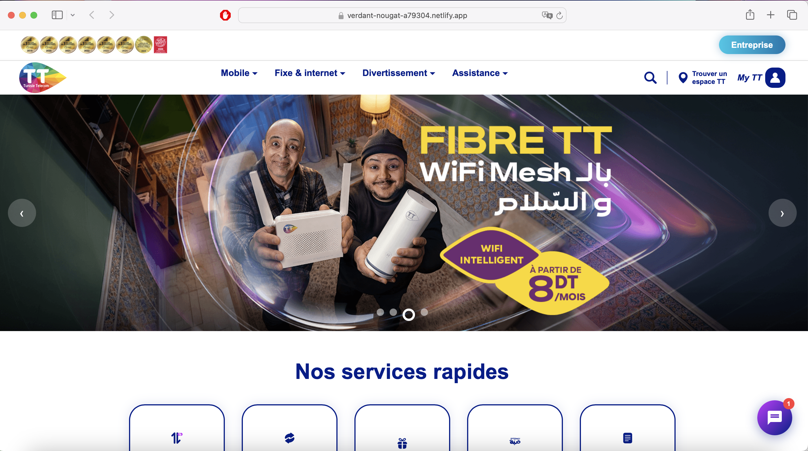
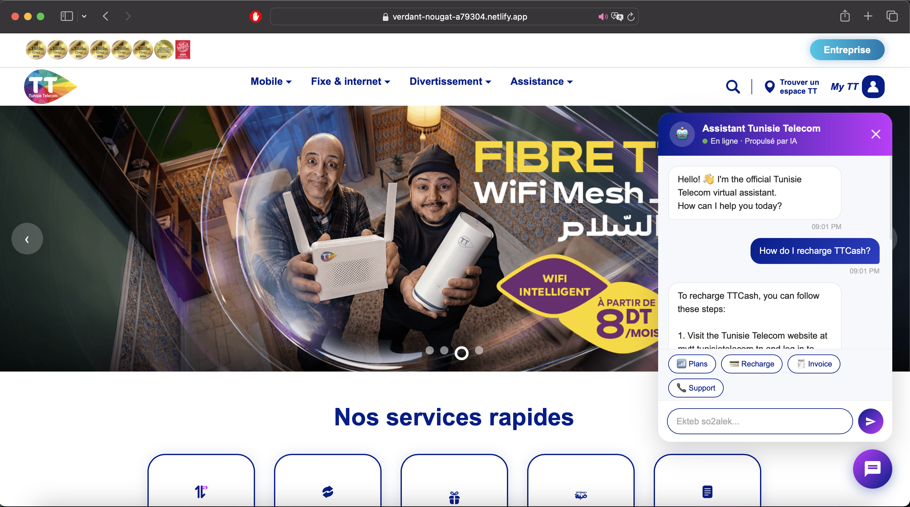

# 🇹🇳 Tunisie Telecom — Clone + AI Chatbot

<div align="center">


**🌐 Live Demo → [verdant-nougat-a79304.netlify.app]([https://verdant-nougat-a79304.netlify.app](https://agent-6a39836afe0d1f0e7c9--verdant-nougat-a79304.netlify.app))**

</div>

---

## 📋 About

A pixel-faithful clone of the **Tunisie Telecom** customer portal, enhanced with an **AI-powered chatbot** built on the Groq API (LLaMA 3.3 70B). The assistant supports **French, Arabic, and English**, solves technical issues step by step, and guides users toward the right service.

> ⚠️ **Educational project** — built for front-end learning purposes only. Not affiliated with Tunisie Telecom.

---

## 📸 Screenshots

### Homepage


### AI Chatbot


---

## ✨ Features

### 🎨 UI Components

| Component | Description |
|-----------|-------------|
| **Hero Carousel** | Auto-sliding banner with 4 slides, manual nav & dot indicators |
| **Quick Services** | 5 shortcuts to the most-used MyTT services |
| **Mobile Plans** | 9 scrollable internet packages with price & validity |
| **Entertainment Accordion** | 6 animated accordion categories |
| **News Cards** | 3 latest news cards with date & read-more links |
| **Good Deals** | MyTT App promo + Kelma loyalty program |
| **Portability** | Quick access to the *172# portability service |
| **Help Section** | Multi-channel contact: phone, Messenger, social media |
| **Full Footer** | Useful links + App Store / Google Play / AppGallery store buttons |

### 🤖 AI Chatbot

- **Multilingual** — auto-detects the user's language (FR / AR / EN) and replies accordingly
- **Step-by-step troubleshooting** — slow internet, network issues, recharge, billing, calls & SMS
- **Quick reply buttons** — Plans, Recharge, Invoice, Support
- **Smart escalation** — only suggests calling 1298 after all self-service options are exhausted
- **Typing animation** — animated dots while the AI generates a response

---

## 🛠️ Tech Stack

```
├── HTML5          → Page structure
├── CSS3           → Custom styles, CSS variables, animations
├── Bootstrap 5.3  → Layout & base components
├── Font Awesome   → Icons (store buttons, UI elements)
├── Vanilla JS     → Carousel, accordion, forfaits scroll
└── Groq API       → LLaMA 3.3 70B → AI chatbot engine
```

---

## 🚀 Getting Started

### Prerequisites
- Any modern browser (Chrome, Firefox, Edge, Safari)
- A free Groq API key from [console.groq.com](https://console.groq.com/keys)

### Run Locally

```bash
# 1. Clone the repository
git clone https://github.com/YOUR_USERNAME/YOUR_REPO.git

# 2. Navigate into the folder
cd YOUR_REPO

# 3. Open in your browser
open index.html
# or just double-click index.html
```

### Configure the Chatbot

Inside `index.html`, replace the Groq API key:

```javascript
const GROQ_API_KEY = 'gsk_YOUR_API_KEY_HERE';
```

> 💡 **Tip:** Never commit a real API key to a public repo. Use environment variables or a backend proxy in production.

---

## 📁 Project Structure

```
📦 project/
 ┣ 📄 index.html          → Main page (single file)
 ┣ 📁 images/
 ┃ ┣ 🖼️ logo.svg
 ┃ ┣ 🖼️ logo-small.svg
 ┃ ┣ 🖼️ mytt.svg
 ┃ ┣ 🖼️ portail-1920x600.png
 ┃ ┣ 🖼️ [other slide & section images]
 ┃ ┗ 🖼️ [SVG service icons]
 ┗ 📄 README.md
```

---

## 🤖 Chatbot Architecture

```
User sends a message
        ↓
Language detection (FR / AR / EN)
        ↓
Request sent to Groq API (LLaMA 3.3 70B)
  • System prompt: role definition + solutions per issue type
  • Full conversation history included (context-aware)
        ↓
Response displayed with typing animation
        ↓
If all solutions fail → redirect to 1298 / 71001298
```

**Issues handled by the chatbot:**
- 📶 Slow / no internet → step-by-step router diagnosis
- 📡 Network / coverage → airplane mode, restart, coverage map
- 💳 TTCash recharge → check balance *123#, online recharge, MyTT history
- 🧾 Invoice → online payment, check via *100#
- 📞 Calls / SMS → credit check, SIM, device restart
- 📦 Mobile plans → full list with data, price & validity

---


## ⚠️ Legal Disclaimer

This is an **unofficial reproduction** created solely for **educational and portfolio purposes**. All trademarks, logos, and content belong to **Tunisie Telecom**. No commercial affiliation or intent.

---

## 👤 Author
**Nourhen Riahi** 
 
